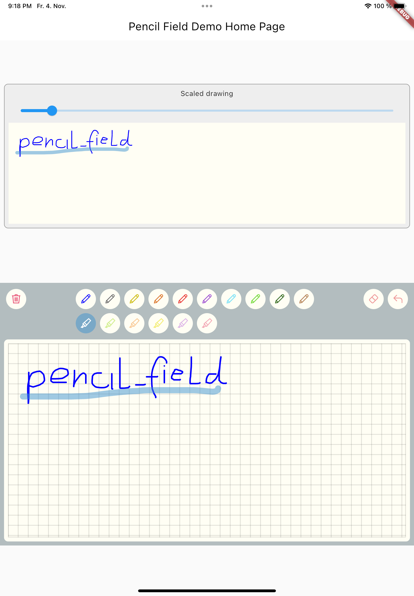

<h1 align="center">FLUTTER PENCIL FIELD</h1>

# pencil_field 0.0.1
Widget for pencil / stylus input on different devices and platforms. This widget is intended
for any freehand input like signatures or drawings. The widget also supports full persistence
of the input. It can either be accessed as JSON (to keep it editable) or as image (e.g., for
archiving or immutability reasons).

<p align="center">
    
</p>
<br>

## Installing

Add to pubspec.yaml file

```dart
dependencies:
  pencil_field: ^0.0.1
```

Import

```dart
import 'package:pencil_field/pencil_field.dart';
```

## How to use
The PencilField can be embedded in any screen (in this case in a StatefulWidget):
```dart
PencilField(
  controller: widget.controller,
  pencilPaint: pencilPaint,
  onPencilDrawingChanged: widget.onPencilDrawingChanged,
  decoration: PencilDecoration(
    type: PencilDecorationType.chequered,
    backgroundColor: Colors.white,
    patternColor: Colors.grey[300]!,
    numberOfLines: 10,
    lineWidth: 2,
    padding: const EdgeInsets.all(10),
  ),
  pencilOnly: true,
)
 ```

And resulting input can be displayed like so (also embedded in a StatefulWidget). As everything
is stored in vector format scaling (e.g. for creating previews) is easy:
```dart
PencilDisplay(
  pencilDrawing: widget.controller.drawing.scale(
    scale: scale,
  ),
  decoration: PencilDecoration(backgroundColor: Colors.white),
)
 ```

## Features
<br>

### PencilField
| Name                   | Type                      | Default          | Description                                              |
|------------------------|---------------------------|------------------|----------------------------------------------------------|
| key                    | `Key?`                    |                  | Assign key to PencilField widget                         |
| controller             | `PencilController`        | Always required  | Controller to interact with the widget during user input |
| pencilPaint            | `PencilPaint`             | Always required  | The paint that will be used for the current interaction  |
| decoration             | `PencilDecoration?`       | Blank decoration | Style of the background (see below)                      |
| onPencilDrawingChanged | `OnPencilDrawingChanged?` |                  | Callback when the content of the drawing changes         |
| pencilOnly             | `bool`                    | false            | If set to true only input from pen devices is used       |
<br>

### PencilFieldDecoration
| Name            | Type                  | Default            | Description                                                                                                          |
|-----------------|-----------------------|--------------------|----------------------------------------------------------------------------------------------------------------------|
| type            | `PencilDeorationType` | blank              | Type of decoration. It can either be blank, chequered, lines, dots. Examples can be found in test folder.            |
| padding         | `EdgeInsets`          | EdgeInsets.all(0)  | Inner space of the decoration. The pattern will only be drawn inside                                                 |
| backgroundColor | `Color`               | Colors.transparent | Color of the background.                                                                                             |
| patternColor    | `Color`               | Colors.black54     | Color of the pattern                                                                                                 |
| lineWidth       | `double`              | 1.0                | Line width for the pattern. In case of dots this is used for the radius.                                             |
| numberOfLines   | `int`                 | 0                  | Number of lines. In case of the chequered pattern the vertical distance is used for the horizontal distance as well. |
<br>

### PencilDisplay
| Name          | Type                | Default         | Description                         |
|---------------|---------------------|-----------------|-------------------------------------|
| key           | `Key?`              |                 | Assign key to PencilField widget    |
| pencilDrawing | `PencilDrawing`     | Always required | The drawing that shall be displayed |
| decoration    | `PencilDecoration?` |                 | Style of the background.            |
<br>

## PencilDrawing
| Name          | Type                 | Default         | Description                                    |
|---------------|----------------------|-----------------|------------------------------------------------|
| strokes       | `<PencilStrokes>[]`  | Always required | Initial set of strokes. Can be an empty array. |

PencilDrawing also lets you save (toJson) and load (fromJson) a drawing. It also provides its own versioning mechanism to ensure
compatibility with future version.
<br>
<br>

## Additional information
A full example is provided in the repository.

<br>

## Upcoming features
- Additional eraser that only erases strokes within a circle
- Pan support for the input widget and the display widget
- Pinch support for the display widget
- Input widget decoration that supports images as background