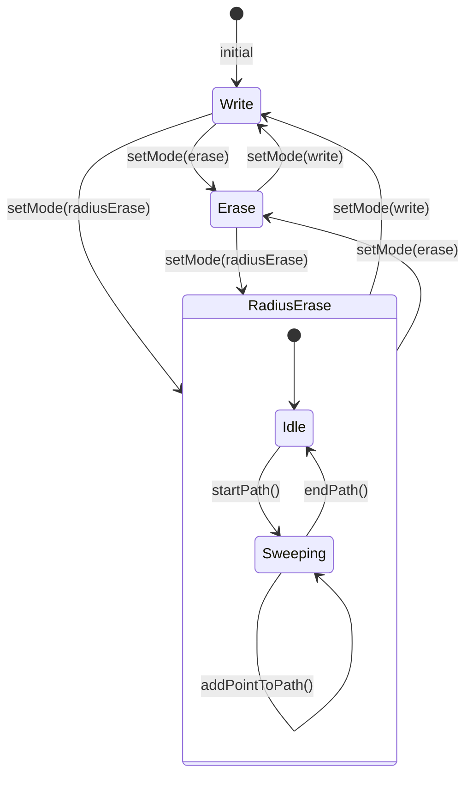

# Data Model: Radius-Based Sweep Eraser

## Entities

### PencilMode (modified)

Enum defining the interaction mode of the controller.

| Value | Description |
|-------|-------------|
| `write` | Drawing mode (existing) |
| `erase` | Line-intersection eraser (existing, unchanged) |
| `radiusErase` | **NEW** — Radius-based sweep eraser |

---

### PencilUndoAction (new — sealed class)

Represents a single undoable action.

| Variant | Fields | Description |
|---------|--------|-------------|
| `UndoStrokeRestore` | `PencilStroke stroke` | Restores a deleted stroke (used by line-intersection erase) |
| `UndoDrawingSnapshot` | `PencilDrawing drawing` | Restores entire drawing state (used by radius erase) |

---

### PencilFieldController (modified — new state)

| Field | Type | Description |
|-------|------|-------------|
| `_eraserRadius` | `double` | Radius for the sweep eraser (default: 10.0) |
| `_preRadiusEraseSnapshot` | `PencilDrawing?` | Drawing state before current radius erase gesture |
| `_undoActions` | `List<PencilUndoAction>` | Replaces `_undoStrokes` — polymorphic undo stack |

---

### PencilStroke (modified — new methods)

| Method | Signature | Returns |
|--------|-----------|---------|
| `pointToSegmentDistance` | `static double pointToSegmentDistance(Point p, Point segStart, Point segEnd)` | Distance from point to segment |
| `splitByRadius` | `List<PencilStroke> splitByRadius({required List<Point> eraserPoints, required double radius})` | List of surviving sub-strokes |

## State Transitions

